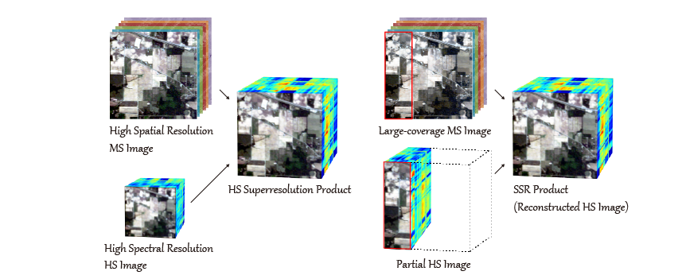

# Spectral Superresolution of Multispectral Imagery with Joint Sparse and Low-Rank Learning 

Lianru Gao, Danfeng Hong, Jing Yao, Bing Zhang, Paolo Gamba, Jocelyn Chanussot
---------------------

The code in this toolbox implements the ["Spectral Superresolution of Multispectral Imagery with Joint Sparse and Low-Rank Learning"](https://ieeexplore.ieee.org/document/8672122).
More specifically, it is detailed as follow.

Citation
---------------------

**Please kindly cite the papers if this code is useful and helpful for your research.**

     @article{gao2020spectral,
      title     = {Spectral Superresolution of Multispectral Imagery with Joint Sparse and Low-Rank Learning},
      author    = {L. Gao and D. Hong and J. Yao and B. Zhang and P. Gamba and J. Chanussot},
      journal   = {IEEE Trans. Geosci. Remote Sens.}, 
      year      = {2020},
      publisher = {IEEE}
     }

System-specific notes
---------------------
The code was tested in Matlab R2016a or higher versions on Windows 10 machines.

How to use it?
---------------------

Directly run demo.m to reproduce the results on the Indian Pine data, which exists in the aforementioned paper.  

The funciton MS_Simulation.m can simulate the Sentinel-2 MS data used in our paper.

Please note that to speed up the model convergence, the optimization procedures of the low-rank dictionary learning (D_Step) are slightly different from those introduced in our paper but they are equivalent in updating each variables.

If you want to run the code in your own data, you can accordingly change the input (e.g., data) and tune the parameters.

If you encounter the bugs while using this code, please do not hesitate to contact us.

Licensing
---------

Copyright (C) 2020 Danfeng Hong

This program is free software: you can redistribute it and/or modify it under the terms of the GNU General Public License as published by the Free Software Foundation, version 3 of the License.

This program is distributed in the hope that it will be useful, but WITHOUT ANY WARRANTY; without even the implied warranty of MERCHANTABILITY or FITNESS FOR A PARTICULAR PURPOSE. See the GNU General Public License for more details.

You should have received a copy of the GNU General Public License along with this program.

Contact Information:
--------------------

Danfeng Hong: hongdanfeng1989@gmail.com 
Danfeng Hong is with the Remote Sensing Technology Institute (IMF), German Aerospace Center (DLR), Germany;  
&nbsp; &nbsp; &nbsp; &nbsp; &nbsp; &nbsp; &nbsp; &nbsp; &nbsp; &nbsp; &nbsp; &nbsp; &nbsp; &nbsp; with the Singnal Processing in Earth Oberservation (SiPEO), Technical University of Munich (TUM), Germany. 
